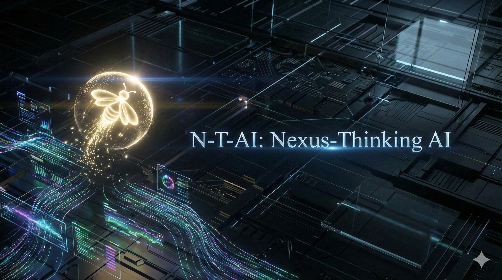

# N-T-AI (Nexus-Thinking AI)



<div align="center">

[](https://github.com/BOHUYESHAN-APB/N-T-AI)
[](LICENSE)
[](https://flutter.dev)
[](https://afdian.com/a/N-T-AI)
[](https://cloud.siliconflow.cn/i/oiWI8xjZ)

</div>

**N-T-AI** is a cross-platform AI assistant application built with Flutter, designed to provide a highly customizable, emotionally interactive, and autonomous AI companion experience.

For the Chinese version of the documentation, see: [中文文档](docs/README_zh-CN.md)

---

## 💖 Support & Sponsorship

If you find this project helpful, please consider supporting us:

*   **[Sponsor on Afdian (爱发电)](https://afdian.com/a/N-T-AI)**: Support our development directly.
*   **[Register on SiliconFlow](https://cloud.siliconflow.cn/i/oiWI8xjZ)**: Use our referral link to get 20M free tokens and support us with compute credits.

---

## 📖 Table of Contents
- [Core Features](#-core-features)
- [Project & Naming](#-project--naming)
- [Architecture](#-architecture)
- [Installation](#-installation)
- [Build & Compile](#-build--compile)
- [Roadmap](#-roadmap)
- [License](#-license)

---

## 🗺️ Roadmap & Development Plan

### 🎯 Goal: Mobile-First, Standalone Intelligence
Our primary goal is to provide a complete, high-performance AI experience on mobile devices (Android/iOS) without requiring a separate PC backend server.

### 🚧 Development Phases

#### Phase 1: Hybrid Architecture (Current)
- **Frontend (Flutter)**: UI, Chat Interface, Basic Logic.
- **Backend (Python)**: Complex Logic (ReAct Agent, Memory, TTS/STT, Live2D/3D Static Server).
- **Status**: Functional on Windows/Linux. Android requires a remote backend connection.

#### Phase 2: Feature Migration (In Progress)
- **Live2D/3D Rendering**: 
  - [x] **Backend**: Serve static assets via FastAPI.
  - [x] **Frontend**: WebView integration for rendering.
  - [x] **Live2D Import**: Support uploading and managing Live2D models via Flutter UI.
  - [ ] **3D Engine**: Implement Babylon.js renderer based on `dlp3d.ai` architecture (Havok physics, GLB support).
  - [ ] **Standalone**: Bundle assets in Flutter App, remove backend dependency for rendering.
- **TTS (Text-to-Speech)**:
  - [x] **Cloud**: Integrate OpenAI/Azure/SiliconFlow TTS directly in Flutter.
    - Supported Models: `FunAudioLLM/CosyVoice2-0.5B` (Emotion-capable), `fishaudio/fish-speech-1.5`, `RVC/v2`.
    - **Verified**: SiliconFlow API integration confirmed working with default voice fallback.
  - [ ] **Local**: Integrate on-device models (e.g., Sherpa-onnx) via FFI.
- **STT (Speech-to-Text)**:
  - [x] **Cloud**: Integrate OpenAI Whisper/SiliconFlow API directly in Flutter.
    - Supported Models: `FunAudioLLM/SenseVoiceSmall` (High speed), `TeleAI/TeleSpeechASR` (Open Source).
    - **Verified**: SiliconFlow API integration confirmed working (WAV format).
  - [ ] **Local**: Integrate on-device Whisper via FFI.

#### Phase 3: Pure Flutter / Standalone Mode (Target)
- **Serverless Logic**: Port all Python "Brain" logic (Memory, Search, Tools) to Dart.
- **Local LLM**: Support running small LLMs (e.g., Llama-3-8B-Quantized) directly on Android via MLC-LLM or MediaPipe.
- **Result**: A fully offline-capable, privacy-focused AI companion app.

---

## 🚀 Core Features

### 1. Multimodal & Emotional Engine
*   **Expression Agent**: Real-time emotional inference engine that displays dynamic expressions (Dynamic Island style) based on conversation context.
*   **Vision Capabilities**: 
    *   **Direct Input**: Support for multimodal interactions using GPT-4o, Claude 3.5 Sonnet, Qwen-VL, etc.
    *   **Vision Fallback Agent**: If the primary model (e.g., DeepSeek-Chat) does not support images, the system automatically delegates the image to a specialized Vision Agent (e.g., Qwen-VL). The agent describes the image, and this textual description is fed back to the primary model, ensuring seamless "sight" capabilities regardless of the main model's limitations.
*   **Human-like Message Stream**: Simulates natural human chatting rhythm by breaking long responses into multiple short messages.

### 2. Autonomous Agent System (ReAct)
*   **Web Search & Browsing**: The system can autonomously search the web (DuckDuckGo, Bing, Baidu) and visit webpages to answer complex questions.
*   **Multi-Engine Fallback**: 
    *   **Search**: Automatically falls back from DuckDuckGo -> Bing -> Baidu if results are insufficient or blocked.
    *   **Image Search**: Validates image URLs in real-time (checking for 403/404 errors) and retries with different engines to ensure valid image display.
*   **Frontend-Only Mode (Planned)**: Future updates will enable these agent capabilities directly within the Flutter frontend, removing the dependency on the Python backend for users who prefer a lightweight setup.

### 3. Memory & Personalization
*   **Long-term Memory**: Remembers user preferences, facts, and past conversations.
*   **Persona System**: Customizable system prompts and "Thinking" styles (e.g., Firefly persona).

---

## 🏷️ Project & Naming

To clarify the terminology used in this project:

*   **N-T-AI (System)**: The complete application suite, including the Flutter Frontend and the Python Backend.
*   **Astra-Me**: Specifically refers to the **Python Backend** service (FastAPI). It acts as the "Soul" or "System" layer that handles complex logic, memory, and tool execution.
*   **Firefly**: Refers to the **Intelligent Agent** logic or the default persona within the application.

> **Disclaimer**: The default AI persona name "Firefly" is a codename and is not directly affiliated with the character from *Honkai: Star Rail*. All game names and related terms mentioned belong to their respective copyright holders (HoYoverse / miHoYo).

---

## 📦 Deployment & Installation

### 🐳 Docker Deployment (Recommended)

We provide two Docker configurations for different needs. These are compatible with self-hosted platforms like **Dokploy**, Coolify, or standard Docker Compose.

#### 1. N-T-AI System (Full Stack)
Deploys both the Flutter Web Frontend and the Python Backend. Ideal for a complete, self-contained web experience.
*   **Directory**: `docker/n-t-ai-system`
*   **Access**: Frontend at `http://localhost:80`, Backend at `http://localhost:8000`.

#### 2. Astra-Me (Backend Only)
Deploys only the Python Backend. Use this if you are running the App on your phone/PC and just need the backend service.
*   **Directory**: `docker/astra-me`
*   **Access**: API at `http://localhost:8000`.

### ☁️ Free Hosting (Vercel / Render)

#### Vercel
*   **Frontend**: The Flutter Web app can be deployed as a static site.
*   **Backend (Astra-Me)**: Can be deployed as a Serverless Function. We include a `vercel.json` in the `backend` directory for this purpose.

---

## 🏗️ Architecture

### Dual-Mode Operation

N-T-AI supports two operational modes, controlled by the `Enable Python Backend` setting:

1.  **Direct Mode (Client-Only)**:
    *   Flutter app connects directly to LLM APIs (OpenAI, DeepSeek, etc.).
    *   Lightweight, no local server required.
    *   *Limitation*: Advanced features like Memory, Mood Analysis, and Web Search are currently disabled in this mode.

2.  **Backend Proxy Mode (Recommended)**:
    *   Flutter app sends requests to the local Python backend (`localhost:8000`).
    *   **Dynamic Configuration**: The frontend passes your API keys and model selection to the backend via HTTP Headers (`X-Target-Api-Key`, `X-Target-Base-Url`, etc.).
    *   **Full Capabilities**: Enables the ReAct Agent, Vision Fallback, Memory System, and robust Image Search validation.

For a detailed technical breakdown of the interaction logic, please refer to [Architecture & Logic Documentation](docs/architecture_and_logic.md).

---

## 🧠 Recommended Models & Cloud Strategy

### ☁️ Primary Cloud Provider: SiliconFlow (硅基流动)
We prioritize **[SiliconFlow](https://cloud.siliconflow.cn/i/oiWI8xjZ)** as our primary cloud API provider for LLM, TTS, STT, Image Generation, and Embeddings.
*   **Support Us**: Use referral code `oiWI8xjZ` or [Sign up here](https://cloud.siliconflow.cn/i/oiWI8xjZ).
*   **Strategy**: SiliconFlow -> Domestic Clouds (Ali/Baidu/Tencent) -> International Clouds (AWS/Azure).

#### Recommended SiliconFlow Models
| Type | Model ID | Pricing | Notes |
| :--- | :--- | :--- | :--- |
| **STT** | `FunAudioLLM/SenseVoiceSmall` | **Free** | High accuracy. |
| **TTS** | `FunAudioLLM/CosyVoice2-0.5B` | ¥50/1M | Fast speed. |
| **TTS** | `IndexTeam/IndexTTS-2` | ¥50/1M | High quality. |
| **TTS** | `fnlp/MOSS-TTSD-v0.5` | ¥50/1M | [OpenMOSS](https://huggingface.co/OpenMOSS-Team/MOSS-TTSD-v0.5) |

*API Docs: [TTS](https://docs.siliconflow.cn/cn/api-reference/audio/create-speech) | [STT](https://docs.siliconflow.cn/cn/api-reference/audio/create-audio-transcriptions) | [Voice Cloning](https://docs.siliconflow.cn/cn/api-reference/audio/upload-voice)*
*Standardization Guide: [Internal API Reference](docs/api_reference_siliconflow.md)*

### 🏠 Local/Self-Hosted Recommendations
For users deploying locally, we recommend:
*   **STT**: [SenseVoiceSmall](https://www.modelscope.cn/models/iic/SenseVoiceSmall)
*   **TTS (Speed)**: [CosyVoice2-0.5B](https://www.modelscope.cn/models/iic/CosyVoice2-0.5B), [MegaTTS3](https://www.modelscope.cn/models/ByteDance/MegaTTS3)
*   **TTS (Quality)**: [IndexTTS-2](https://www.modelscope.cn/models/IndexTeam/IndexTTS-2), [Step-Audio-EditX](https://www.modelscope.cn/models/stepfun-ai/Step-Audio-EditX)

### ⚠️ Disclaimer & Distribution Policy
*   **Liability**: We are not responsible for the performance or issues of these third-party models.
*   **Licensing**:
    *   Models with **Apache 2.0** licenses may be redistributed in our future backend packages.
    *   **CosyVoice2**: Due to unclear licensing, we will **NOT** distribute this model. Users must download it manually.

---

## 🗺️ Roadmap & Development Plan

---

         - The primary model/backend should detect `image_url` parts and attempt a multimodal request; if that fails, the Vision Agent fallback should be invoked.

     - Tool calling protocol (must be compatible with backend):

         - When the model decides it needs external information, it must output a single-line tool call in exact format:

         ```text
         [TOOL_CALL] web_search(query="hydrogen peroxide bottle images")
         ```

         - Or to visit a page:

         ```text
         [TOOL_CALL] visit_page(url="https://example.com/article-with-images")
         ```

         - Frontend local ReAct or proxy-forward should not add extra text around the tool call line; the backend executes the tool and returns `[TOOL_RESULT]` content.

     - Vision agent fallback flow (recommendation):

         1. Frontend sends a message containing `image_url` parts to the backend (or local model).
         2. If the primary model responds with an error indicating it cannot handle visual input, or if it fails to produce image descriptions, the client/backend should:
                - Invoke the configured Vision Agent (e.g., Qwen-VL) to describe the images (parallelize up to 3 images);
                - Replace or append the Vision Agent descriptions as plain text to the original user message, then retry the request to the primary model;
                - Return the final result to the frontend, and optionally include `[IMAGE: url]` tags where search results provided images.

     - Search fallbacks (image search):

         - Frontend can expose a search configuration (Settings → Web Search) to select preferred search engine (DuckDuckGo/Bing/Baidu/Google).
         - If the primary engine returns no usable image links, the frontend/backend should try the next engine in order and log attempts. Recommended priority: DDGS → Bing → Baidu → Google.

     - Image validity & display:

         - Backend will return image markers in the form `[IMAGE: https://...]`. Frontend should:
             1. Verify accessibility before showing inline previews (simple HEAD request or rely on browser image loading to detect failures);
             2. If an image cannot be loaded, show a placeholder and annotate that the image is inaccessible (possible hotlinking or permission issue).

     - Request headers & settings mapping:

         - In `AiClient.sendChat` and `streamChat`, ensure the following are included as needed:
             - `user` field: current chat/contact ID (required for context isolation);
             - Optional headers (driven by Provider/Settings):
                 - `X-Enable-Browser: true|false` — allow tool/search calls;
                 - `X-Search-Region: zh-CN|us-en|...` — search region preference;
                 - `X-Vision-Api-Key`, `X-Vision-Base-Url`, `X-Vision-Model`, `X-Vision-Prompt`, `X-Vision-Fallback` — vision agent config (if frontend directly invokes vision service).

     - Frontend UI / settings suggestions:

         - In Settings → Agents provide:
             - Vision Agent provider selection (already surfaced in `AgentsTab`);
             - Search engine priority and a "auto-retry" toggle;
             - A log / debug level toggle (can send `X-Debug-Level` to backend for more verbose logs).

     - Security & privacy:

         - Do not log or display private image URLs in plaintext (e.g., private cloud links). Use hashing or partial masking in logs.
         - Do not persist third-party API keys in plaintext in the frontend; reference provider config and ask user to input keys in a trusted environment.

     - Example: Dart frontend build-and-send (pseudocode)

         ```dart
         // messages: contains history and the current message, currentUserId: active chat id
         final messages = [
             AiMessage(role: 'system', content: '...persona...'),
             AiMessage(role: 'user', content: [
                 {'type':'text','text':'Please describe this photo'},
                 {'type':'image_url','image_url': {'url': imageUrl}}
             ])
         ];

         final resp = await AiClient.sendChat(
             ai: aiSettings,
             messages: messages,
             userId: currentUserId,
         );
         // resp may contain [IMAGE: https://...] or plain-text descriptions
         ```

     - Local end-to-end test steps (quick check):

         1. Restart backend:

                ```powershell
                cd backend
                uvicorn main:app --reload
                ```

         2. Hot-reload frontend and enable DevTools/logging. Test scenarios:
                - Scenario A: Upload an image hosted on a public URL (e.g., CDN) and ask "What is this bottle?"
                - Scenario B: Ask "Give me 3 hydrogen peroxide images" and observe whether the backend triggers web_search/visit_page and returns `[IMAGE: ...]` markers.

         3. Inspect backend logs for `Received chat completion request`, `Tool Call Detected`, `Vision Agent` branches, and search-fallback entries.

## 🍎 Call for Apple Developers

We welcome users with Apple devices and Apple Developer Program membership to collaborate with me on developing the iOS and macOS versions of the application.

If no one is available to assist, I will handle this myself after purchasing an M5 Mac mini when the new Mac mini is released.

## 🗺️ Roadmap & Future Plans

### Phase 1: Foundation (Current)
- [x] Cross-platform Flutter Application (Windows/Android/Linux).
- [x] Python Backend (FastAPI) for advanced logic.
- [x] Basic LLM Integration (OpenAI/Local/Custom).
- [x] Live2D Integration (WebView based).

### Phase 2: Enhanced Interaction (In Progress)
- [ ] **Frontend Migration**: Prioritize migrating backend logic (ReAct Agent, Memory) to the Flutter frontend to reduce dependencies.
- [ ] **Local Model Adaptation**:
    - Create "One-Click Start Packages" for open-source STT/TTS models (e.g., CosyVoice, SenseVoice) which are complex to configure compared to standard LLMs.
    - Distribute these packages via cloud storage for easy deployment.
- [ ] **Enhanced Live2D**: Improve character expressions, motions, and emotional feedback loops.
- [ ] **3D Engine**: Implement Babylon.js renderer for 3D avatars (Havok Physics) - *In Development*.

### Phase 3: General AI Agent & Advanced Capabilities
- [ ] **Deep Research**: Enable access to professional databases (e.g., campus networks) for scientific research scenarios.
- [ ] **OS Control**: Grant the agent control over a virtualized OS (Linux/Windows) in a secure container to perform tasks like browsing and document editing.
- [ ] **Advanced Content Creation**: Generate high-quality, non-templated PPTs and documents.
- [ ] **Digital Life/Idle Mode**: "Virtual Digital Human" features with autonomous idle behaviors.
- [ ] **Multi-Model Architecture**: Coordinate large parameter models with multiple small specialized models/agents.

### Phase 4: Tooling & Ecosystem
- [ ] **Open Code CLI Integration**:
    - Integrate a custom branch of [open-code-cli](https://opencode.ai/) (MIT License) to provide advanced CLI capabilities (similar to Claude Code CLI), bypassing MCP.
- [ ] **Custom Agents**: Support user-defined agents with robust Function Calling and Tool Use.

---

## Development Guide

*   **State Management**: ChangeNotifier / InheritedWidget (SettingsScope)
*   **Storage**: sqflite_common_ffi (SQLite) / shared_preferences
*   **AI Integration**: HTTP REST API (OpenAI Compatible)

---

## 📦 Installation

1.  **Prerequisites**: Ensure Flutter SDK (3.0+) is installed.
2.  **Clone Repository**:
    `ash
    git clone https://github.com/BOHUYESHAN-APB/N-T-AI.git
    cd N-T-AI/flutter_application
    `
3.  **Run**:
    `ash
    flutter pub get
    flutter run
    `

---

## 🔨 Build & Compile

### Windows (MSIX)
`ash
cd flutter_application
flutter clean
flutter pub get
dart run msix:create
`
*Output: lutter_application/build/windows/x64/runner/Release/*

### Android (APK)
`ash
cd flutter_application
flutter clean
flutter pub get
flutter build apk --release
`
*Output: lutter_application/build/app/outputs/flutter-apk/app-release.apk*

---

## 🤝 Acknowledgements & Credits

This project stands on the shoulders of giants. We gratefully acknowledge the following open-source projects and tools:

*   **[N.E.K.O. (Next-gen Emotive Kernel for Operators)](https://github.com/BOHUYESHAN-APB/N.E.K.O.)**: 
    *   Provided inspiration for **Live2D interaction logic** and **WebRTC-based screen sharing/audio processing** modules.
    *   *License*: MIT License.
*   **[dlp3d.ai](https://github.com/dlp3d/dlp3d.ai)**:
    *   Providing architectural inspiration for our upcoming **3D rendering engine** (currently in progress).
    *   *License*: MIT License.
*   **GitHub Copilot**:
    *   Special thanks for the AI-assisted programming support throughout the development process.

We respect the open-source community and strictly adhere to the MIT license terms of these upstream projects.

---

## 📄 License

**Dual-Licensed Software**

*   **Non-Commercial**: [AGPLv3 with Restrictions](LICENSE). Free for personal, non-profit use.
*   **Commercial**: [Commercial License](COMMERCIAL_LICENSE_TERMS.md). Required for business use.

*By using this software, you agree to the terms in the LICENSE file and acknowledge that the authors assume no liability.*

---

*Built with ❤️ by the N-T-AI Team*
