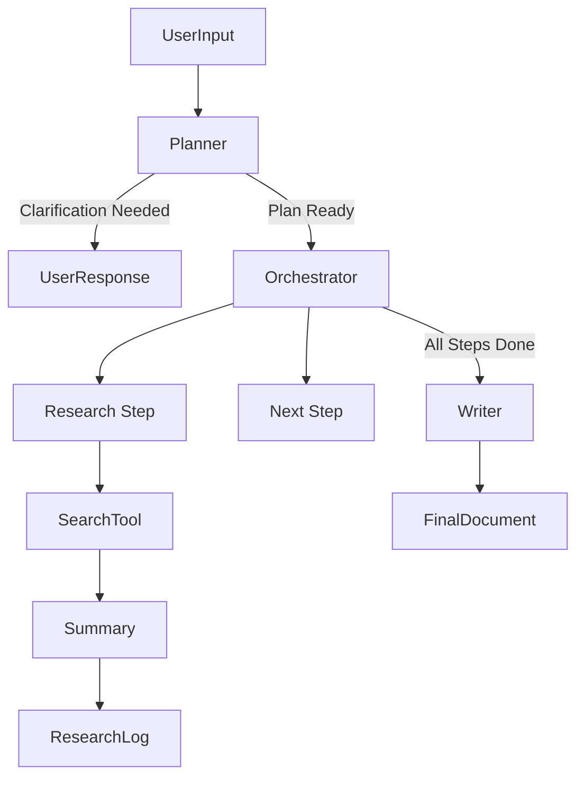

# Deep Research & Document Generation Skill

## 1. Skill Metadata
- **Name**: Deep Research & Document Generation
- **Version**: 1.0.0
- **Description**: A hierarchical agentic skill capable of performing deep internet research, analyzing data, and generating professional documents (Report, PPT, Excel) with citations and data visualization.
- **Author**: N-T-AI Team
- **Tags**: #research #document-generation #planning #web-search

## 2. Capability Boxing (Ingredients)

### 2.1 Core Prompts (Ingredients)
| Ingredient ID | Role | Description |
|--------------|------|-------------|
| `planner_sys` | Planner | Deconstructs user requests into actionable research steps and clarifies ambiguities. |
| `researcher_sys` | Researcher | Executes search queries, analyzes web content, and synthesizes findings. |
| `writer_sys` | Writer | Compiles research findings into structured document formats (Markdown, JSON for Office). |

### 2.2 Tools & Resources
- **Search Engine**: `SearchService` (Google/Bing/DuckDuckGo) via `search_service.py`
- **Browser**: `Selenium/Puppeteer` (Headless) for content extraction.
- **Office Suite**: `python-docx`, `python-pptx`, `pandas` for file generation.
- **Sandboxed Environment**: `SandboxService` for file operations and intermediate storage.

## 3. Workflow & Logic

### 3.1 Architecture
This skill follows a **Plan-Execute-Verify** loop with a hierarchical structure:
1.  **Planner Node**: Analyzes the request. If ambiguous, generates a clarification questionnaire. If clear, produces a `TaskPlan` (Steps).
2.  **Orchestrator**: Iterates through the `TaskPlan`.
3.  **Researcher Node**: For each step, generates search queries, fetches results, and summarizes findings into `research_log.md`.
4.  **Writer Node**: Reads the full `research_log.md` and generates the final artifact (Report/PPT/Excel) based on the user's requested format.

### 3.2 Data Flow


## 4. Integration Guide

### 4.1 Python API
```python
from app.agents.deep_research_skill.scripts.main import DeepResearchSkill

skill = DeepResearchSkill(config={...})
async for event in skill.run(user_input="Research AI Trends"):
    print(event)
```

### 4.2 Error Handling
- **Network Failures**: Retries with exponential backoff.
- **Empty Search Results**: Fallback to broad queries or related topics.
- **Context Limit**: Auto-summarization of long web pages before feeding to LLM.
